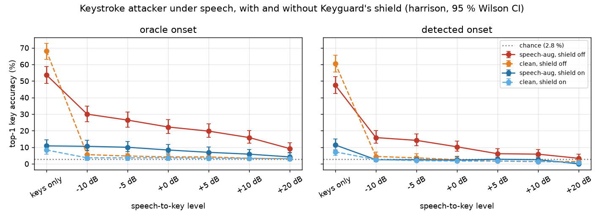

# Attack under speech (plan 04, WP7)

## Question
Hearsay already showed that keystrokes in the background don't break voice detection. The reverse makes Keyguard's
threat real on a call: **with someone talking over the typing, can an acoustic attacker still read the keys?** If so,
does Keyguard's shield bring it back toward chance while the speech stays intact and still reads as a real voice?

## Setup
- **Keys:** Keyguard's `data/pool/harrison.npz` (one MacBook keyboard, 36 keys x 25 isolated presses, 16 kHz).
  Per-key seeded 60/40 split: 540 train, 360 test presses. No test press is used in training.
- **Attacker: PROVISIONAL.** Keyguard's `KeyNet` + `torch_logmel`, trained by CallGuard in this script with Keyguard's
  `train_attacker` (40 epochs) on the public harrison bank. In-domain (same keyboard, same room), isolated presses.
  It stands in for the teammate's attacker and is to be replaced by the teammate's weights when they ship.
  - `clean`: trained on clean train presses.
  - `speech-aug` (adaptive): clean train presses + 4 copies each mixed with speech at a random +0..+20 dB. Its
    speech comes only from the *training* speakers. Saved to `runs/provisional_keynet_speechaug.pt` (gitignored)
    for the live pipeline.
- **Speech:** 200 real bona fide LibriSpeech/LJSpeech clips from Hearsay's `test_internal` split, split by speaker
  (135 clips train / 65 test). The demo voices (LibriSpeech speakers 100 and 2803) are excluded from both pools.
- **Mixing (synthetic, not a recorded call):** each test press sits at a random spot in a 1.5 s test-speaker speech
  excerpt. **Level = speech-to-key power ratio**: mean power of the 1.5 s speech excerpt over mean power of the 0.3 s
  key window. The same excerpt and position are reused at every level (paired design).
- **Onsets:** *oracle* (the true onset) and *detected* (Keyguard's `segment.onsets` on the mixture, nearest peak
  within 30 ms; a miss counts as a wrong guess). A real attacker only has *detected*. The CallGuard dashboard attacks
  at OS key timestamps (oracle onsets = worst-case eavesdropper); with keys only, detected onsets are nearly as good
  (47.5 vs 53.6 % top-1), so oracle is a fair upper bound for quiet typing.
- **Shield (headline):** Keyguard DSP `Shield` with **`ShieldConfig(key_frames=26)`** (208 ms, press + release;
  everything else default: strength 1.0, randomize 1.0, decoys 0), as `app/keyguard_real.KeyguardShield`
  runs it, given the **true** onsets (the victim has OS key events). Keyguard's default `key_frames=14` (112 ms) stops
  before the key release, which the attacker's 300 ms window hears. 26 was chosen by the integrator on these same 360
  test presses (keys only, noise 41 dB under the key: 14 -> 22.2 % top-1, 20 -> 10.8, 26 -> 7.5, 34 -> 5.8), a mild
  selection effect that the teammate's held-out data should confirm. `key_frames=14` is kept as a secondary row at
  keys only and +10 dB. The attackers are not retrained against either shield.
- **Metrics:** top-1 / top-3 over n = 360 test presses, 95 % Wilson CIs, chance 1/36 = 2.8 %. Speech quality: STOI
  and wideband PESQ on each 1.5 s mixture, averaged.
- **Hearsay check (criterion 3):** 100 full real clips (>= 3 s) from the *test* speakers; 5 test presses per clip
  (one per fifth of the clip) at +10 dB speech-to-key (same level definition, whole clip power); 26-frame shield with
  true onsets; scored by CallGuard's `HearsayDriver(mode="r4ft", threads=8, device="cpu")`; flagged =
  `p_synthetic > 0.5`.
- Seed 0 throughout. Runtime 12.3 min on 8 CPU threads (attackers 3.2 min, attack grid 4.4 min, Hearsay 4.6 min).
  Full per-cell data: `attack_under_speech.csv` (`shield` = off / on (26 frames) / on14), `attack_under_speech_hearsay.csv`.

## Results

**Top-1 (%) [95 % CI], adaptive `speech-aug` attacker.** Shield on = `key_frames=26`, true onsets.

| level | oracle, shield off | oracle, shield on | detected, shield off | detected, shield on | onsets found (off / on) |
|---|---|---|---|---|---|
| keys only | 53.6 [48.4, 58.7] | 10.8 [8.0, 14.5] | 47.5 [42.4, 52.7] | 11.4 [8.5, 15.1] | 99 % / 99 % |
| −10 dB | 30.0 [25.5, 34.9] | 10.6 [7.8, 14.2] | 15.8 [12.4, 20.0] | 2.5 [1.3, 4.7] | 76 % / 59 % |
| −5 dB | 26.4 [22.1, 31.2] | 10.0 [7.3, 13.5] | 14.2 [10.9, 18.1] | 2.5 [1.3, 4.7] | 69 % / 53 % |
| 0 dB | 22.2 [18.2, 26.8] | 8.3 [5.9, 11.7] | 10.3 [7.5, 13.9] | 2.2 [1.1, 4.3] | 61 % / 46 % |
| +5 dB | 19.7 [15.9, 24.1] | 6.9 [4.8, 10.1] | 6.1 [4.1, 9.1] | 2.8 [1.5, 5.0] | 55 % / 43 % |
| **+10 dB** | **15.8 [12.4, 20.0]** | **5.8 [3.9, 8.8]** | **5.8 [3.9, 8.8]** | **2.5 [1.3, 4.7]** | 49 % / 40 % |
| +20 dB | 9.2 [6.6, 12.6] | 4.2 [2.5, 6.8] | 3.3 [1.9, 5.7] | 0.0 [0.0, 1.1] | 43 % / 34 % |

Top-3 at +10 dB: oracle 34.4 % [29.7, 39.5] off / 19.7 % [15.9, 24.1] on; detected 13.1 % [10.0, 16.9] off /
6.1 % [4.1, 9.1] on (chance 8.3 %).

**Shield length, 26 vs 14 frames (speech-aug attacker, top-1 %):**

| | keys only, oracle | keys only, detected | +10 dB, oracle | +10 dB, detected | STOI shield vs mix, +10 dB |
|---|---|---|---|---|---|
| no shield | 53.6 | 47.5 | 15.8 | 5.8 | |
| key_frames 14 (Keyguard default) | 16.9 [13.4, 21.2] | 15.0 [11.7, 19.1] | 5.8 [3.9, 8.8] | 1.7 [0.8, 3.6] | 0.934 |
| **key_frames 26 (CallGuard)** | 10.8 [8.0, 14.5] | 11.4 [8.5, 15.1] | 5.8 [3.9, 8.8] | 2.5 [1.3, 4.7] | **0.897** |

The longer region helps on quiet typing (16.9 to 10.8 %) but not at +10 dB, where both leave 5.8 %; it costs STOI
(0.934 to 0.897).

**`clean` attacker (trained without speech):** keys only 68.1 % oracle / 60.6 % detected, shield on 8.3 %. With any
speech it collapses to near chance (+10 dB: 3.3 % oracle, 1.4 % detected). A naive attacker is not the threat under
speech; an adaptive one is.

**Speech quality with the 26-frame shield** (mean over 360 excerpts):

| level | STOI shield vs mix | PESQ shield vs mix | STOI mix vs clean speech | STOI shield vs clean speech |
|---|---|---|---|---|
| −10 dB | 0.872 | 1.94 | 0.952 | 0.892 |
| 0 dB | 0.889 | 2.51 | 0.979 | 0.898 |
| +5 dB | 0.894 | 2.67 | 0.987 | 0.900 |
| **+10 dB** | **0.897** | **2.86** | 0.992 | 0.900 |
| +20 dB | 0.900 | 3.06 | 0.997 | 0.902 |

Note these excerpts are 1.5 s with one key each (one keystroke per 1.5 s of speech), so the shielded fraction is high;
STOI over longer speech with sparser typing will be higher.

**Hearsay on real voices, +10 dB keys, 26-frame shield (n = 100 clips):**

| condition | flagged as synthetic | median p_synthetic | max p_synthetic |
|---|---|---|---|
| clean speech | 0 / 100 = 0.0 % [0.0, 3.7] | 0.14 | 0.32 |
| keys, shield off | 0 / 100 = 0.0 % [0.0, 3.7] | 0.14 | 0.37 |
| keys, shield on | 2 / 100 = 2.0 % [0.6, 7.0] | 0.18 | 0.59 |

(With the 14-frame shield in the previous run: 1 / 100, median 0.17.)

## Verdict on plan 04's pass criteria (headline shield: key_frames 26)

1. **Adaptive attacker at +10 dB far above chance (CI lower bound > 3x chance = 8.3 %):**
   - **PASS with oracle onsets:** 15.8 % [12.4, 20.0], 5.7x chance.
   - **FAIL with detected onsets** (what a real eavesdropper has): 5.8 % [3.9, 8.8]; above chance, but the lower
     bound is below 8.3 %. The bottleneck is segmentation: Keyguard's onset detector finds 49 % of presses under
     +10 dB speech.
   - On stage: "an adaptive attacker reads 16 % of keys (6x chance) at +10 dB when it knows when you type, and about
     half the keys of quiet typing", not "it reads your password".
2. **Shield on: top-1 <= 2x chance (5.6 %) and STOI >= 0.9: FAIL (marginal on both).**
   - Top-1 with oracle onsets: 5.8 % [3.9, 8.8] against a 5.6 % bar (the 14-frame shield gives the same 5.8 %).
     With detected onsets: 2.5 % [1.3, 4.7], PASS.
   - STOI at +10 dB: 0.897 (shield vs mix), 0.900 (shield vs clean speech); just under / at the 0.9 bar. PESQ 2.86.
     The 14-frame shield had 0.934, so the longer region is what pushes it under.
3. **Hearsay flags <= 2 % of real voices on the shielded speech: PASS (at the boundary):** 2 / 100 = 2.0 %
   [0.6, 7.0]. Clean and unshielded: 0 %. n = 100 cannot show the true rate is <= 2 %; the shield moves median
   p_synthetic 0.14 to 0.18.

## Issues for the teammate (Keyguard)
- **Shield vs the adaptive attacker (criterion 2):** with true onsets, a speech-augmented KeyNet keeps 5.8 % top-1 at
  +10 dB with either key region (14 or 26 frames), and 10.8 % on quiet typing with 26 frames. Lengthening the region
  trades STOI (0.934 to 0.897) for gains only on quiet typing. Needed: a shield that removes more key information per
  frame rather than more frames, e.g. the adversarial perturbation stage trained against the speech-aug attacker.
  Target: <= 5.6 % top-1 at +10 dB with STOI >= 0.9.
- **Key-region length:** the default `key_frames=14` misses the key release (100-150 ms after onset). CallGuard ships
  26, chosen on these same test presses; please confirm on held-out data.
- **Noise floor:** the provisional attackers were trained on near-silent harrison presses. With white noise 30 dB
  under the key-window power, the clean attacker drops from 70 % to 1.7 % top-1 and the speech-aug one from 61 % to
  46 % (40 dB under: clean 33 %, speech-aug 59 %) (integrator's measurement). Noise robustness is an open item for
  the teammate's attacker.
- **Attacker segmentation under speech (criterion 1, detected):** `segment.onsets` finds 49 % of presses at +10 dB
  and 43 % at +20 dB, which caps the realistic attack. If the teammate's newer attacker (e.g. the overlap attacker on
  continuous typing) does not rely on energy onsets, re-run this script with it.
- Re-run this script when the final attacker and shield weights ship (plan 05).

## Limits
- **One keyboard, in-domain, isolated presses** (harrison). No cross-keyboard, cross-room or continuous typing.
- **Synthetic mixing**, not a recorded call: no codec, no echo cancellation, no noise suppression, no room acoustics.
  Meeting apps' noise suppression would likely remove much of the keystroke energy before an attacker sees it.
- **Level definition:** speech power over key-window power; the speech excerpt includes pauses, so the voice during
  words is louder than the nominal level. Other papers define SNR differently.
- The attacker is provisional and not retrained on shielded audio; a shield-aware attacker could do better.
- `key_frames=26` was selected on the test presses (mild selection effect).
- No language model: no lattice / dictionary decoding of whole passwords, which would raise per-key accuracy.
- Hearsay check: 100 clips, one seed, r4ft mode only.
