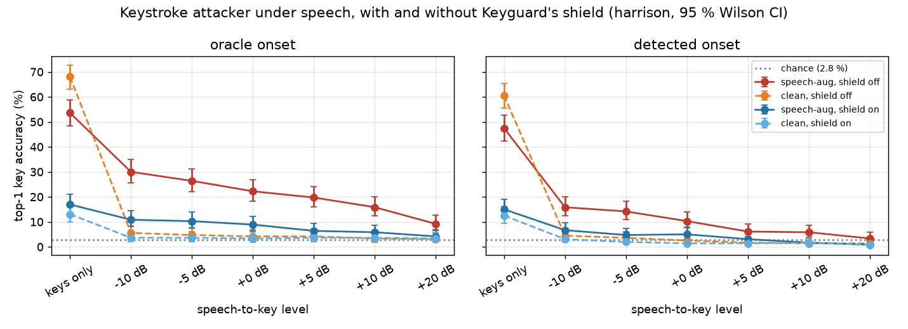

# Attack under speech (plan 04, WP7)

## Question
Hearsay already showed that keystrokes in the background don't break voice detection. The reverse makes Keyguard's
threat real on a call: **with someone talking over the typing, can an acoustic attacker still read the keys?** If so,
does Keyguard's shield bring it back toward chance while the speech stays intact and still reads as a real voice?

## Setup
- **Keys:** Keyguard's `data/pool/harrison.npz` (one MacBook keyboard, 36 keys x 25 isolated presses, 16 kHz).
  Per-key seeded 60/40 split: 540 train, 360 test presses. No test press is used in training.
- **Attacker: PROVISIONAL.** Keyguard's `KeyNet` + `torch_logmel`, trained by CallGuard in this script with Keyguard's
  `train_attacker` (40 epochs) on the public harrison bank. In-domain (same keyboard, same room), isolated presses.
  It stands in for the teammate's attacker and is to be replaced by the teammate's weights when they ship.
  - `clean`: trained on clean train presses.
  - `speech-aug` (adaptive): clean train presses + 4 copies each mixed with speech at a random +0..+20 dB. Its
    speech comes only from the *training* speakers. Saved to `runs/provisional_keynet_speechaug.pt` (gitignored)
    for the live pipeline.
- **Speech:** 200 real bona fide LibriSpeech/LJSpeech clips from Hearsay's `test_internal` split, split by speaker
  (135 clips train / 65 test). The demo voices (LibriSpeech speakers 100 and 2803) are excluded from both pools.
- **Mixing (synthetic, not a recorded call):** each test press sits at a random spot in a 1.5 s test-speaker speech
  excerpt. **Level = speech-to-key power ratio**: mean power of the 1.5 s speech excerpt over mean power of the 0.3 s
  key window. The same excerpt and position are reused at every level (paired design).
- **Onsets:** *oracle* (the true onset) and *detected* (Keyguard's `segment.onsets` on the mixture, nearest peak
  within 30 ms; a miss counts as a wrong guess). A real attacker only has *detected*.
- **Shield:** Keyguard DSP `Shield` with **`ShieldConfig()` defaults** (strength 1.0, randomize 1.0, decoys 0,
  key_frames 14), exactly as `callguard/drivers/keyguard_real.KeyguardShield` runs it, given the **true** onsets (the
  victim has OS key events). All headline numbers use this config. The attackers are not retrained on shielded audio.
- **Metrics:** top-1 / top-3 over n = 360 test presses, 95 % Wilson CIs, chance 1/36 = 2.8 %. Speech quality: STOI
  and wideband PESQ on each 1.5 s mixture, averaged.
- **Hearsay check (criterion 3):** 100 full real clips (>= 3 s) from the *test* speakers; 5 test presses per clip
  (one per fifth of the clip) at +10 dB speech-to-key (same level definition, whole clip power); shield with true
  onsets; scored by CallGuard's `HearsayDriver(mode="r4ft", threads=8, device="cpu")`; flagged = `p_synthetic > 0.5`.
- Seed 0 throughout. Runtime 10.6 min on 8 CPU threads (attackers 3.2 min, attack grid 3 min, Hearsay 4.4 min).
  Full per-cell data: `attack_under_speech.csv`, `attack_under_speech_hearsay.csv`.

## Results

**Top-1 (%) [95 % CI], adaptive `speech-aug` attacker.** Shield = Keyguard defaults with true onsets.

| level | oracle, shield off | oracle, shield on | detected, shield off | detected, shield on | onsets found (off / on) |
|---|---|---|---|---|---|
| keys only | 53.6 [48.5, 58.7] | 16.9 [13.4, 21.2] | 47.5 [42.4, 52.7] | 15.0 [11.7, 19.1] | 99 % / 99 % |
| −10 dB | 30.0 [25.5, 34.9] | 10.8 [8.0, 14.5] | 15.8 [12.4, 20.0] | 6.7 [4.5, 9.7] | 76 % / 61 % |
| −5 dB | 26.4 [22.1, 31.2] | 10.3 [7.6, 13.9] | 14.2 [10.9, 18.2] | 4.7 [3.0, 7.4] | 69 % / 54 % |
| 0 dB | 22.2 [18.2, 26.8] | 8.9 [6.4, 12.3] | 10.3 [7.6, 13.9] | 5.0 [3.2, 7.8] | 61 % / 46 % |
| +5 dB | 19.7 [15.9, 24.1] | 6.4 [4.3, 9.4] | 6.1 [4.1, 9.1] | 3.1 [1.7, 5.4] | 55 % / 41 % |
| **+10 dB** | **15.8 [12.4, 20.0]** | **5.8 [3.9, 8.8]** | **5.8 [3.9, 8.8]** | **1.7 [0.8, 3.6]** | 49 % / 36 % |
| +20 dB | 9.2 [6.6, 12.6] | 4.2 [2.5, 6.8] | 3.3 [1.9, 5.7] | 0.8 [0.3, 2.4] | 43 % / 32 % |

Top-3 for the same attacker at +10 dB: oracle 34.4 % [29.7, 39.5] off / 19.7 % [15.9, 24.1] on; detected 13.1 %
[10.0, 16.9] off / 5.3 % [3.4, 8.1] on (chance 8.3 %).

**Top-1 (%), `clean` attacker (trained without speech):** keys only 68.1 [63.1, 72.7] oracle / 60.6 detected. With
any speech it collapses to near chance: +10 dB oracle 3.3 [1.9, 5.7], detected 1.4 [0.6, 3.2]; shield on 3.6 / 1.7.
A naive attacker is not the threat under speech; an adaptive one is.

**Speech quality of the shielded mixture** (mean over 360 excerpts):

| level | STOI shield vs mix | PESQ shield vs mix | STOI mix vs clean speech | STOI shield vs clean speech |
|---|---|---|---|---|
| −10 dB | 0.900 | 2.15 | 0.952 | 0.930 |
| 0 dB | 0.923 | 2.83 | 0.979 | 0.937 |
| +5 dB | 0.930 | 3.09 | 0.987 | 0.939 |
| **+10 dB** | **0.934** | **3.33** | 0.992 | 0.940 |
| +20 dB | 0.939 | 3.57 | 0.997 | 0.941 |

**Hearsay on real voices, +10 dB keys (n = 100 clips):**

| condition | flagged as synthetic | median p_synthetic | max p_synthetic |
|---|---|---|---|
| clean speech | 0 / 100 = 0.0 % [0.0, 3.7] | 0.14 | 0.32 |
| keys, shield off | 0 / 100 = 0.0 % [0.0, 3.7] | 0.14 | 0.37 |
| keys, shield on | 1 / 100 = 1.0 % [0.2, 5.5] | 0.17 | 0.72 |

**Secondary shield config** (the earlier "dashboard" settings `decoys=6, key_frames=6`; from a preliminary run that
still included speakers 100/2803, so indicative only): +10 dB speech-aug, oracle, shield on 9.2 % [6.6, 12.6],
detected 2.8 %; STOI shield vs mix 0.969. It keeps speech a bit cleaner but protects clearly less than the defaults.

## Verdict on plan 04's pass criteria

1. **Adaptive attacker at +10 dB far above chance (CI lower bound > 3x chance = 8.3 %):**
   - **PASS with oracle onsets:** 15.8 % [12.4, 20.0], 5.7x chance.
   - **FAIL with detected onsets** (what a real attacker has): 5.8 % [3.9, 8.8]; above chance, but the lower bound
     is below 8.3 %. The bottleneck is segmentation: Keyguard's onset detector finds only 49 % of presses under
     +10 dB speech. The per-press classifier still works on the presses it finds.
   - So the keystroke threat under speech is real in principle, but with this provisional attacker and Keyguard's
     energy onset detector it is weak at realistic call levels. On stage, say "an adaptive attacker reads 16 % of
     keys (6x chance) at +10 dB when it can locate the keystrokes", not "reads your password".
2. **Shield on: top-1 <= 2x chance (5.6 %) and STOI >= 0.9:**
   - STOI: **PASS**, 0.934 at +10 dB (>= 0.90 at every level; PESQ 3.3).
   - Top-1 with detected onsets: **PASS**, 1.7 % [0.8, 3.6].
   - Top-1 with oracle onsets: **FAIL (marginal)**, 5.8 % [3.9, 8.8] against a 5.6 % bar. The shield cuts the
     adaptive attacker by 2.7x but does not bring it to 2x chance when the attacker locates the key. With keys only it
     leaves 16.9 % (6x chance).
   - Overall: **FAIL** on the strict oracle reading, PASS for the realistic (detected-onset) attacker.
3. **Hearsay flags <= 2 % of real voices on the shielded speech:** **PASS**, 1 / 100 = 1.0 % [0.2, 5.5] (clean and
   unshielded: 0 %). The Wilson upper bound (5.5 %) is above 2 %, so n = 100 cannot prove <= 2 %; it is consistent
   with it. The shield raises median p_synthetic slightly (0.14 to 0.17).

## Issues for the teammate (Keyguard)
- **Shield vs the adaptive attacker (criterion 2, oracle):** with defaults and true onsets, a speech-augmented KeyNet
  keeps 5.8 % top-1 at +10 dB and 16.9 % on keys alone. The shield needs to be stronger against an attacker that
  knows where the key is, e.g. the adversarial perturbation stage trained against the speech-aug attacker, or wider
  inpainting at the onset transient. Target: <= 5.6 % top-1 at +10 dB with STOI >= 0.9.
- **Attacker segmentation under speech (criterion 1, detected):** `segment.onsets` finds 49 % of presses at +10 dB
  and 43 % at +20 dB, which caps the realistic attack. If the teammate's newer attacker (e.g. the overlap attacker on
  continuous typing) does not rely on energy onsets, re-run this script with it: the threat case likely gets stronger.
- Re-run this script when the final attacker and shield weights ship (plan 05).

## Limits
- **One keyboard, in-domain, isolated presses** (harrison). No cross-keyboard, cross-room or continuous typing.
- **Synthetic mixing**, not a recorded call: no codec, no echo cancellation, no noise suppression, no room acoustics.
  Meeting apps' noise suppression would likely remove much of the keystroke energy before an attacker sees it.
- **Level definition:** speech power over key-window power; the speech excerpt includes pauses, so the voice during
  words is louder than the nominal level. Other papers define SNR differently.
- The attacker is provisional and not retrained on shielded audio; a shield-aware attacker could do better.
- No language model: no lattice / dictionary decoding of whole passwords, which would raise per-key accuracy.
- Hearsay check: 100 clips, one seed, r4ft mode only.
